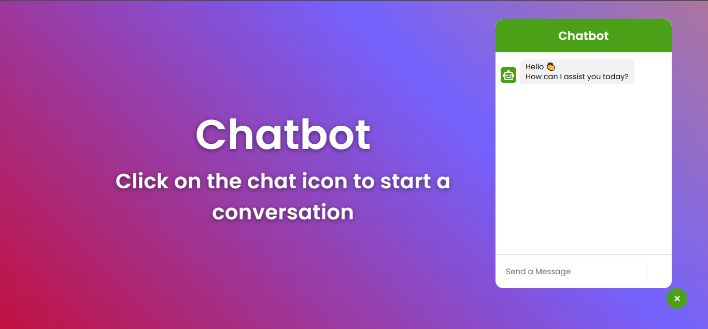

## Overview



[]() [](https://www.npmjs.com/package/chatbot-widget-ui) []()

**Authors**: [Hassen Amri](https://www.linkedin.com/in/hassenamri005/), [Raed Lazreg](https://www.linkedin.com/in/raid-lazreg-61378127a/), [Taha Berguiga](https://www.linkedin.com/in/taha-berguiga/)

**NPM Package Link:**
[chatbot-widget-ui](https://www.npmjs.com/package/chatbot-widget-ui)

**Package Github Repository Link:**
[chatbot-widget-ui](https://github.com/Hassenamri005/chatbot-widget-ui)

**chatbot-widget-ui** is a library for creating React.js chatbot widget UI, built using TypeScript. It provides comprehensive customization features that leverage OpenAI API completions.

**Features**:

- Implemented using React.js and TypeScript for robustness and type safety.
- Provides a customizable user interface for integrating chatbot functionality into web applications.
- Offers various configuration options to tailor the chatbot widget's appearance and behavior.
- Utilizes **OpenAI API** for powerful natural language processing capabilities.

## Usage

The library enables easy integration of chatbot features into React.js applications, enhancing user interaction and experience.

1. Install the latest version:

```bash
npm install chatbot-widget-ui@latest
```

2. Import the library:

```javascript
import { ChatBotWidget } from "chatbot-widget-ui";
```

3. Use the `ChatBotWidget` component:

```javascript
<ChatBotWidget
  apiKey="YOUR_OPENAI_API_KEY_HERE"
  chatIcon={<div>O</div>}
  chatbotName="Customer Support"
  isTypingMessage="Typing..."
  IncommingErrMsg="Oops! Something went wrong. Try again."
  primaryColor="#eb4034"
  inputMsgPlaceholder="Send a Message"
/>
```

### Usage Example

```javascript
import React from "react";
import { ChatBotWidget } from "chatbot-widget-ui";

const App = () => {
  // save all messages conversation
  // Example: [{'type': 'user', 'text': 'hello'}, {'type': 'bot', 'text': 'Hello, how can i assist you today!'}, ...]
  const [messages, setMessages] = useState<string[]>([]);

  return (
    <div>
      <ChatBotWidget
        apiKey="YOUR_OPENAI_API_KEY_HERE"
        chatIcon={<div>O</div>}
        chatbotName="Customer Support"
        isTypingMessage="Typing..."
        IncommingErrMsg="Oops! Something went wrong !"
        primaryColor="#eb4034"
        inputMsgPlaceholder="Send a Message"
        conversation={messages}
        handleNewMessage={setMessages}
      />
    </div>
  );
};

export default App;
```

## Chatbot Component Props

| Prop Name             | Type       | Default Value                                     | Description                                                                         |
| --------------------- | ---------- | ------------------------------------------------- | ----------------------------------------------------------------------------------- |
| `apiKey`              | string     |                                                   | The API key required for the **OpenAI API** integration.                            |
| `chatbotName`         | string     | `"Chatbot"`                                       | The name/title of the chatbot displayed in the header.                              |
| `isTypingMessage`     | string     | `"Typing..."`                                     | The message displayed when the chatbot is typing a response.                        |
| `IncommingErrMsg`     | string     | `"Oops! Something went wrong. Please try again."` | The error message displayed when an API request fails.                              |
| `primaryColor`        | string     | `"#eb4034"`                                       | The primary color used for styling elements like headers, buttons, and backgrounds. |
| `inputMsgPlaceholder` | string     | `"Send a Message"`                                | The placeholder text shown in the chat input textarea.                              |
| `chatIcon`            | any        | `ChatIcon()` (ReactElement)                       | The icon displayed in the chatbot toggler button.                                   |
| `conversation`        | `array`    | [ ]                                               | Empty array to store all conversation messages.                                     |
| `handleNewMessage`    | `function` |                                                   | Placeholder for a function to process new messages.                                 |
